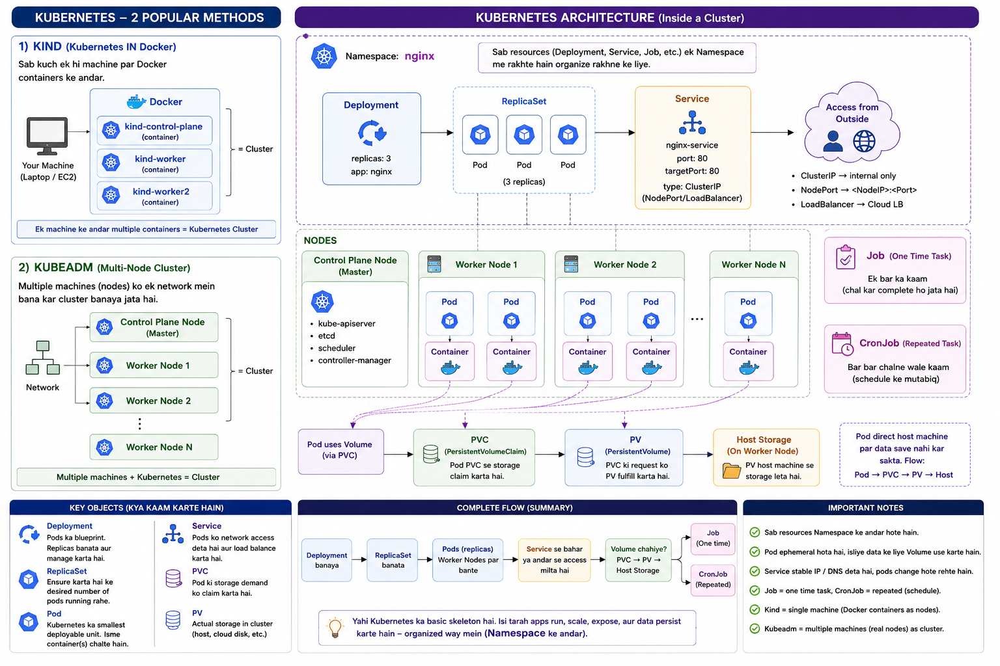

# Production Comparison

| Tool | Purpose |
|------|---------|
| Kind | Learning using Docker containers |
| Minikube | Local Development & Practice |
| kubeadm | Self-managed Production Cluster |
| EKS | Managed Kubernetes on AWS |
| AKS | Managed Kubernetes on Azure |
| GKE | Managed Kubernetes on Google Cloud |


<p align="center">
  
</p>


# Kubernetes Resources Used in Real Projects

| Resource | Used in Companies? | Purpose |
|-----------|-------------------|---------|
| ✅ Deployment | **Yes (Most Common)** | Deploy Frontend, Backend, APIs, and Microservices |
| ⚠️ ReplicaSet | **Rarely (Directly)** | Automatically created and managed by a Deployment |
| ⚠️ Pod | **Rarely (Directly)** | Testing, Debugging, or Running a temporary container |
| ✅ StatefulSet | **Yes** | Stateful applications like MongoDB, MySQL, PostgreSQL, Kafka, Elasticsearch |
| ✅ DaemonSet | **Yes** | Run one Pod on every Node for Monitoring, Logging, Security (Node Exporter, Fluent Bit, Filebeat) |
| ✅ Job | **Yes** | One-time tasks such as Database Migration, Data Import, Backup |
| ✅ CronJob | **Yes** | Scheduled tasks such as Daily Backup, Report Generation, Cleanup Scripts |

---


## One-Line Revision

- **Pod** → 1 Pod
- **ReplicaSet** → Maintains Multiple Pods
- **Deployment** → ReplicaSet + Multiple Pods + Scaling + Rolling Update + Rollback
- **DaemonSet** → One Pod on Every Worker Node
- **StatefulSet** → Database / Stateful Pods
- **Job** → Runs Once
- **CronJob** → Runs on a Schedule


```
Pod
    │
    └── 1 Pod (Runs one or more Containers)

ReplicaSet
    │
    └── Multiple Pods (Maintains the desired number of Pods)

Deployment
    │
    └── ReplicaSet
          │
          ├── Multiple Pods
          ├── Scaling
          ├── Rolling Update
          └── Rollback

DaemonSet
    │
    └── One Pod on Every Worker Node

StatefulSet
    │
    └── Database / Stateful Pods
        (MongoDB, MySQL, PostgreSQL, Kafka)

Job
    │
    └── Runs Once
        (Backup, Migration, Data Import)

CronJob
    │
    └── Runs on a Schedule
        (Daily Backup, Cleanup, Reports)
```